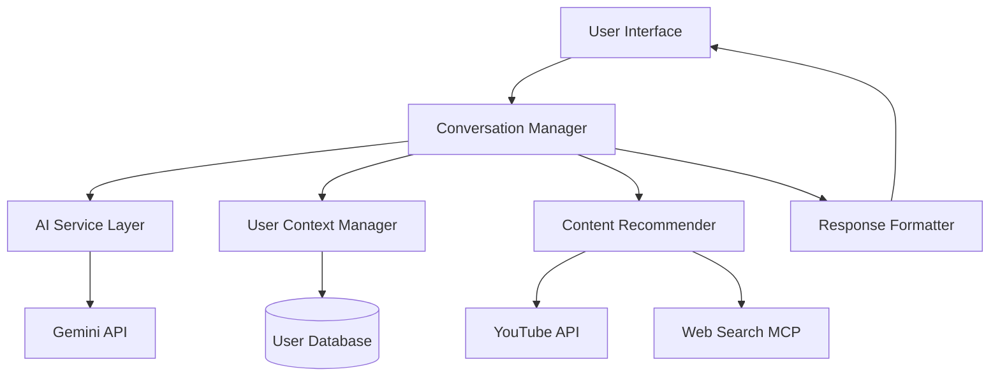

# Design Document

## Overview

The EdAgent conversational AI system is built around a modular architecture that separates concerns between conversation management, AI processing, user context, and content recommendation. The system uses Google's Gemini API as the core language model, with specialized prompt engineering to create a supportive career coaching personality.

## Architecture

### High-Level Architecture



### Component Responsibilities

- **Conversation Manager**: Orchestrates user interactions and maintains conversation flow
- **AI Service Layer**: Handles Gemini API integration and prompt management
- **User Context Manager**: Stores and retrieves user profiles, skills, and preferences
- **Content Recommender**: Searches and filters educational content from various sources
- **Response Formatter**: Structures AI responses for consistent user experience

## Components and Interfaces

### 1. Conversation Manager

**Purpose**: Central orchestrator for all user interactions

**Key Methods**:
```python
class ConversationManager:
    async def handle_message(self, user_id: str, message: str) -> ConversationResponse
    async def start_skill_assessment(self, user_id: str) -> AssessmentSession
    async def generate_learning_path(self, user_id: str, goal: str) -> LearningPath
    async def get_conversation_history(self, user_id: str) -> List[Message]
```

**Responsibilities**:
- Route messages to appropriate handlers
- Maintain conversation state and context
- Coordinate between AI service and content recommendation
- Handle conversation flow logic (assessments, learning paths)

### 2. AI Service Layer

**Purpose**: Manages all interactions with Gemini API

**Key Methods**:
```python
class AIService:
    async def generate_response(self, prompt: str, context: UserContext) -> str
    async def assess_skills(self, responses: List[str]) -> SkillAssessment
    async def create_learning_path(self, goal: str, current_skills: SkillLevel) -> LearningPath
    def build_system_prompt(self, user_context: UserContext) -> str
```

**Configuration**:
- Model: `gemini-1.5-flash` for general conversations
- Model: `gemini-1.5-pro` for complex reasoning (learning paths, assessments)
- Temperature: 0.7 for coaching responses, 0.3 for factual content
- Max tokens: 1000 for responses, 2000 for learning paths

### 3. User Context Manager

**Purpose**: Manages user profiles, preferences, and learning progress

**Key Methods**:
```python
class UserContextManager:
    async def get_user_context(self, user_id: str) -> UserContext
    async def update_skills(self, user_id: str, skills: Dict[str, SkillLevel]) -> None
    async def save_preferences(self, user_id: str, preferences: UserPreferences) -> None
    async def track_progress(self, user_id: str, milestone: Milestone) -> None
```

**Data Storage**:
- SQLite for development/testing
- PostgreSQL for production
- Redis for session caching

### 4. Content Recommender

**Purpose**: Discovers and filters educational content from multiple sources

**Key Methods**:
```python
class ContentRecommender:
    async def search_youtube_content(self, query: str, filters: ContentFilters) -> List[YouTubeVideo]
    async def search_courses(self, skill: str, level: SkillLevel) -> List[Course]
    async def filter_by_preferences(self, content: List[Content], preferences: UserPreferences) -> List[Content]
    async def rank_content(self, content: List[Content], user_context: UserContext) -> List[Content]
```

**Integration Points**:
- YouTube Data API for video search
- Web Search MCP for course platform discovery
- Content quality scoring algorithm
- User preference matching

## Data Models

### Core Models

```python
@dataclass
class UserContext:
    user_id: str
    current_skills: Dict[str, SkillLevel]
    career_goals: List[str]
    learning_preferences: UserPreferences
    conversation_history: List[Message]
    assessment_results: Optional[SkillAssessment]

@dataclass
class SkillLevel:
    skill_name: str
    level: Literal["beginner", "intermediate", "advanced"]
    confidence_score: float
    last_updated: datetime

@dataclass
class LearningPath:
    goal: str
    milestones: List[Milestone]
    estimated_duration: timedelta
    difficulty_level: str
    prerequisites: List[str]

@dataclass
class ContentRecommendation:
    title: str
    url: str
    platform: str
    content_type: Literal["video", "course", "article", "interactive"]
    duration: Optional[timedelta]
    rating: float
    is_free: bool
    skill_match_score: float
```

### Database Schema

```sql
-- Users table
CREATE TABLE users (
    id UUID PRIMARY KEY,
    created_at TIMESTAMP DEFAULT NOW(),
    last_active TIMESTAMP,
    preferences JSONB
);

-- Skills table
CREATE TABLE user_skills (
    user_id UUID REFERENCES users(id),
    skill_name VARCHAR(100),
    level VARCHAR(20),
    confidence_score FLOAT,
    updated_at TIMESTAMP DEFAULT NOW(),
    PRIMARY KEY (user_id, skill_name)
);

-- Conversations table
CREATE TABLE conversations (
    id UUID PRIMARY KEY,
    user_id UUID REFERENCES users(id),
    message TEXT,
    response TEXT,
    timestamp TIMESTAMP DEFAULT NOW(),
    message_type VARCHAR(50)
);
```

## Error Handling

### API Error Management
- **Rate Limiting**: Exponential backoff with jitter for Gemini API
- **Authentication**: Graceful handling of API key issues with user-friendly messages
- **Network Issues**: Retry logic with circuit breaker pattern
- **Quota Exceeded**: Fallback to cached responses or simplified functionality

### User Input Validation
- **Sanitization**: Clean user inputs to prevent injection attacks
- **Length Limits**: Enforce reasonable message length constraints
- **Content Filtering**: Basic profanity and inappropriate content detection

### Graceful Degradation
- **AI Service Down**: Provide pre-written helpful responses
- **Content APIs Unavailable**: Use cached recommendations
- **Database Issues**: Maintain session state in memory temporarily

## Testing Strategy

### Unit Testing
- **AI Service**: Mock Gemini API responses for consistent testing
- **Content Recommender**: Test filtering and ranking algorithms
- **User Context**: Test data persistence and retrieval
- **Conversation Manager**: Test conversation flow logic

### Integration Testing
- **API Integration**: Test actual Gemini API calls with test data
- **Database Operations**: Test with real database connections
- **End-to-End Flows**: Test complete user journeys

### Performance Testing
- **Response Time**: Target <3 second response times
- **Concurrent Users**: Test with multiple simultaneous conversations
- **Memory Usage**: Monitor context storage and cleanup
- **API Rate Limits**: Verify rate limiting implementation

### Test Data Management
```python
# Test fixtures for consistent testing
@pytest.fixture
def sample_user_context():
    return UserContext(
        user_id="test-user-123",
        current_skills={"python": SkillLevel("python", "beginner", 0.6, datetime.now())},
        career_goals=["become a software developer"],
        learning_preferences=UserPreferences(
            learning_style="visual",
            time_commitment="2-3 hours/week",
            budget_preference="free"
        )
    )
```

## Security Considerations

### API Security
- Store Gemini API keys in environment variables
- Implement request signing for sensitive operations
- Use HTTPS for all external API calls
- Rotate API keys regularly

### Data Protection
- Encrypt sensitive user data at rest
- Implement proper session management
- Follow GDPR compliance for user data
- Provide data export and deletion capabilities

### Input Validation
- Sanitize all user inputs
- Implement rate limiting per user
- Validate conversation context size
- Monitor for abuse patterns