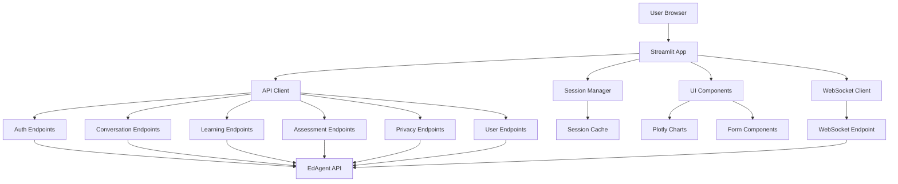

# Design Document

## Overview

The Streamlit API Integration design focuses on creating a comprehensive, maintainable, and user-friendly frontend that fully leverages all available EdAgent API endpoints. The design emphasizes proper error handling, consistent user experience, modular architecture, and robust session management. The integration will transform the current partial implementation into a complete, production-ready web application.

## Architecture

### High-Level Architecture



### Component Responsibilities

- **Session Manager**: Handles authentication state, token management, and user session persistence
- **API Client**: Centralized HTTP client with error handling, retry logic, and response processing
- **UI Components**: Reusable Streamlit components for consistent user interface
- **WebSocket Client**: Real-time communication for chat functionality
- **Error Handler**: Centralized error handling and user feedback system

## Components and Interfaces

### 1. Enhanced API Client

**Purpose**: Centralized, robust API communication layer

**Key Methods**:
```python
class EnhancedEdAgentAPI:
    def __init__(self, base_url: str, session_manager: SessionManager)
    
    # Authentication
    async def register_user(self, email: str, password: str, name: str) -> AuthResult
    async def login_user(self, email: str, password: str) -> AuthResult
    async def refresh_token(self) -> bool
    
    # Conversation
    async def send_message(self, user_id: str, message: str) -> ConversationResponse
    async def get_conversation_history(self, user_id: str, limit: int = 50) -> List[Message]
    async def clear_conversation_history(self, user_id: str) -> bool
    
    # Assessment
    async def start_assessment(self, user_id: str, skill_area: str) -> AssessmentSession
    async def submit_assessment_response(self, assessment_id: str, response: str) -> AssessmentSession
    async def complete_assessment(self, assessment_id: str) -> AssessmentResult
    async def get_user_assessments(self, user_id: str) -> List[AssessmentSession]
    
    # Learning Paths
    async def create_learning_path(self, user_id: str, goal: str) -> LearningPath
    async def get_user_learning_paths(self, user_id: str) -> List[LearningPath]
    async def update_milestone_status(self, path_id: str, milestone_id: str, status: str) -> bool
    async def get_learning_path_progress(self, path_id: str) -> ProgressData
    
    # User Management
    async def get_user_profile(self, user_id: str) -> UserProfile
    async def update_user_preferences(self, user_id: str, preferences: UserPreferences) -> bool
    async def update_user_skills(self, user_id: str, skills: Dict[str, SkillLevel]) -> bool
    async def update_user_goals(self, user_id: str, goals: List[str]) -> bool
    
    # Privacy
    async def get_privacy_settings(self, user_id: str) -> PrivacySettings
    async def update_privacy_settings(self, user_id: str, settings: PrivacySettings) -> bool
    async def export_user_data(self, user_id: str) -> ExportResult
    async def delete_user_data(self, user_id: str, data_types: List[str] = None) -> DeletionResult
    
    # Error handling and retry logic
    async def _make_request(self, method: str, endpoint: str, **kwargs) -> APIResponse
    def _handle_api_error(self, error: Exception, context: str) -> None
    def _should_retry(self, error: Exception) -> bool
```

**Error Handling Strategy**:
- Exponential backoff for rate limiting
- Automatic token refresh for 401 errors
- Circuit breaker pattern for repeated failures
- User-friendly error messages with actionable guidance

### 2. Session Manager

**Purpose**: Comprehensive session and authentication state management

**Key Methods**:
```python
class SessionManager:
    def __init__(self)
    
    # Authentication state
    def is_authenticated(self) -> bool
    def get_current_user(self) -> Optional[UserInfo]
    def get_auth_token(self) -> Optional[str]
    def set_auth_data(self, token: str, user_data: UserInfo) -> None
    def clear_session(self) -> None
    
    # Token management
    def is_token_expired(self) -> bool
    def refresh_token_if_needed(self) -> bool
    def handle_auth_error(self) -> None
    
    # Session persistence
    def save_session_state(self) -> None
    def load_session_state(self) -> None
    def clear_cached_data(self) -> None
    
    # User preferences
    def get_user_preferences(self) -> Optional[UserPreferences]
    def update_user_preferences(self, preferences: UserPreferences) -> None
    
    # Navigation state
    def get_current_tab(self) -> str
    def set_current_tab(self, tab: str) -> None
```

### 3. UI Component Library

**Purpose**: Consistent, reusable UI components with proper error handling

**Key Components**:
```python
# Authentication Components
def render_login_form() -> Optional[LoginData]
def render_registration_form() -> Optional[RegistrationData]
def render_user_profile_sidebar() -> None

# Chat Components
def render_chat_interface(api_client: EnhancedEdAgentAPI, user_id: str) -> None
def render_message_history(messages: List[Message]) -> None
def render_chat_input() -> Optional[str]

# Assessment Components
def render_assessment_dashboard(api_client: EnhancedEdAgentAPI, user_id: str) -> None
def render_assessment_session(session: AssessmentSession) -> None
def render_assessment_results(results: List[AssessmentResult]) -> None

# Learning Path Components
def render_learning_paths_dashboard(api_client: EnhancedEdAgentAPI, user_id: str) -> None
def render_learning_path_creator(api_client: EnhancedEdAgentAPI, user_id: str) -> None
def render_learning_path_progress(path: LearningPath) -> None

# Privacy Components
def render_privacy_dashboard(api_client: EnhancedEdAgentAPI, user_id: str) -> None
def render_data_export_interface(api_client: EnhancedEdAgentAPI, user_id: str) -> None
def render_privacy_settings(api_client: EnhancedEdAgentAPI, user_id: str) -> None

# Analytics Components
def render_progress_analytics(user_data: UserAnalytics) -> None
def render_skill_radar_chart(skills: Dict[str, SkillLevel]) -> None
def render_learning_timeline(progress_data: List[ProgressPoint]) -> None

# Error Handling Components
def render_error_message(error: APIError, context: str) -> None
def render_loading_spinner(message: str = "Loading...") -> None
def render_retry_button(retry_func: Callable) -> None
```

### 4. Enhanced WebSocket Integration

**Purpose**: Real-time chat with proper connection management

**Key Features**:
```python
class EnhancedWebSocketClient:
    def __init__(self, ws_url: str, session_manager: SessionManager)
    
    # Connection management
    async def connect_with_retry(self, user_id: str) -> bool
    async def maintain_connection(self) -> None
    def handle_connection_loss(self) -> None
    
    # Message handling
    async def send_message(self, message: str) -> bool
    def register_message_handler(self, handler: Callable) -> None
    def get_connection_status(self) -> ConnectionStatus
    
    # Streamlit integration
    def integrate_with_streamlit(self) -> None
    def update_chat_display(self, message: WebSocketMessage) -> None
```

## Data Models

### Enhanced Data Models

```python
@dataclass
class APIResponse:
    success: bool
    data: Any
    error: Optional[APIError]
    status_code: int
    headers: Dict[str, str]

@dataclass
class APIError:
    code: str
    message: str
    details: Optional[Dict[str, Any]]
    retry_after: Optional[int]
    is_retryable: bool

@dataclass
class UserInfo:
    user_id: str
    email: str
    name: Optional[str]
    created_at: datetime
    last_active: datetime
    preferences: Optional[UserPreferences]

@dataclass
class ConversationResponse:
    message: str
    response_type: str
    confidence_score: float
    suggested_actions: List[str]
    content_recommendations: List[ContentRecommendation]
    follow_up_questions: List[str]
    metadata: Dict[str, Any]

@dataclass
class AssessmentSession:
    id: str
    user_id: str
    skill_area: str
    questions: List[AssessmentQuestion]
    current_question_index: int
    status: str
    started_at: datetime
    completed_at: Optional[datetime]
    progress: float

@dataclass
class LearningPath:
    id: str
    title: str
    description: str
    goal: str
    milestones: List[Milestone]
    estimated_duration: Optional[int]
    difficulty_level: str
    prerequisites: List[str]
    target_skills: List[str]
    created_at: datetime
    updated_at: datetime
    progress: float

@dataclass
class UserAnalytics:
    skills_assessed: int
    learning_paths_created: int
    total_study_hours: float
    completion_rate: float
    skill_improvements: Dict[str, float]
    recent_activity: List[ActivityEvent]
    progress_over_time: List[ProgressPoint]
```

### State Management Schema

```python
# Streamlit session state structure
SESSION_STATE_SCHEMA = {
    # Authentication
    "user_id": Optional[str],
    "access_token": Optional[str],
    "user_info": Optional[UserInfo],
    "token_expires_at": Optional[datetime],
    
    # Navigation
    "current_tab": str,
    "previous_tab": Optional[str],
    
    # Chat
    "chat_messages": List[Message],
    "chat_input": str,
    "ws_connected": bool,
    
    # Assessments
    "current_assessment": Optional[AssessmentSession],
    "assessment_history": List[AssessmentResult],
    
    # Learning Paths
    "learning_paths": List[LearningPath],
    "current_learning_path": Optional[str],
    
    # User Data
    "user_preferences": Optional[UserPreferences],
    "user_skills": Dict[str, SkillLevel],
    "user_goals": List[str],
    
    # Privacy
    "privacy_settings": Optional[PrivacySettings],
    
    # UI State
    "show_profile_setup": bool,
    "show_error_details": bool,
    "loading_states": Dict[str, bool],
    
    # Cache
    "api_cache": Dict[str, Any],
    "cache_timestamps": Dict[str, datetime]
}
```

## Error Handling

### Comprehensive Error Handling Strategy

**1. API Error Categories**:
```python
class APIErrorType(Enum):
    AUTHENTICATION_ERROR = "auth_error"
    AUTHORIZATION_ERROR = "authz_error"
    VALIDATION_ERROR = "validation_error"
    RATE_LIMIT_ERROR = "rate_limit_error"
    SERVER_ERROR = "server_error"
    NETWORK_ERROR = "network_error"
    TIMEOUT_ERROR = "timeout_error"
    UNKNOWN_ERROR = "unknown_error"

class ErrorHandler:
    def handle_api_error(self, error: APIError, context: str) -> None:
        if error.type == APIErrorType.AUTHENTICATION_ERROR:
            self._handle_auth_error(error)
        elif error.type == APIErrorType.RATE_LIMIT_ERROR:
            self._handle_rate_limit_error(error)
        elif error.type == APIErrorType.NETWORK_ERROR:
            self._handle_network_error(error)
        else:
            self._handle_generic_error(error, context)
    
    def _handle_auth_error(self, error: APIError) -> None:
        st.error("🔐 Authentication expired. Please log in again.")
        self.session_manager.clear_session()
        st.rerun()
    
    def _handle_rate_limit_error(self, error: APIError) -> None:
        retry_after = error.retry_after or 60
        st.warning(f"⏱️ Rate limit reached. Please wait {retry_after} seconds before trying again.")
    
    def _handle_network_error(self, error: APIError) -> None:
        st.error("🌐 Network connection issue. Please check your internet connection and try again.")
        if st.button("Retry"):
            st.rerun()
```

**2. User-Friendly Error Messages**:
```python
ERROR_MESSAGES = {
    "auth_failed": {
        "title": "Authentication Failed",
        "message": "Please check your email and password and try again.",
        "actions": ["Try again", "Reset password"]
    },
    "api_timeout": {
        "title": "Request Timeout",
        "message": "The request is taking longer than expected. This might be due to high server load.",
        "actions": ["Retry", "Try again later"]
    },
    "validation_error": {
        "title": "Invalid Input",
        "message": "Please check your input and make sure all required fields are filled correctly.",
        "actions": ["Review input", "Get help"]
    }
}
```

**3. Graceful Degradation**:
- Show cached data when API is unavailable
- Provide offline functionality for basic features
- Display helpful messages when features are temporarily unavailable
- Maintain user input during error recovery

## Testing Strategy

### Component Testing

**1. API Client Testing**:
```python
class TestEnhancedEdAgentAPI:
    @pytest.fixture
    def mock_api_client(self):
        return EnhancedEdAgentAPI("http://test-api", MockSessionManager())
    
    async def test_authentication_flow(self, mock_api_client):
        # Test successful login
        result = await mock_api_client.login_user("test@example.com", "password")
        assert result.success
        assert result.user_info.email == "test@example.com"
    
    async def test_error_handling(self, mock_api_client):
        # Test API error handling
        with pytest.raises(APIError):
            await mock_api_client.login_user("invalid", "credentials")
    
    async def test_retry_logic(self, mock_api_client):
        # Test retry mechanism for transient failures
        pass
```

**2. UI Component Testing**:
```python
class TestUIComponents:
    def test_chat_interface_rendering(self):
        # Test chat interface with mock data
        pass
    
    def test_assessment_flow(self):
        # Test assessment component workflow
        pass
    
    def test_error_display(self):
        # Test error message rendering
        pass
```

**3. Integration Testing**:
```python
class TestStreamlitIntegration:
    def test_full_user_journey(self):
        # Test complete user workflow from registration to learning path completion
        pass
    
    def test_session_persistence(self):
        # Test session state management across page reloads
        pass
    
    def test_websocket_integration(self):
        # Test real-time chat functionality
        pass
```

### Performance Testing

**1. Load Testing**:
- Test with multiple concurrent users
- Measure response times for API calls
- Test WebSocket connection limits
- Monitor memory usage with large datasets

**2. UI Performance**:
- Test rendering performance with large chat histories
- Measure chart rendering times
- Test pagination performance
- Monitor Streamlit app responsiveness

## Security Considerations

### Authentication Security

**1. Token Management**:
```python
class SecureTokenManager:
    def store_token(self, token: str) -> None:
        # Store token securely in session state
        # Implement token encryption if needed
        pass
    
    def validate_token_format(self, token: str) -> bool:
        # Validate JWT token format
        pass
    
    def handle_token_expiry(self) -> None:
        # Automatic token refresh
        pass
```

**2. Input Validation**:
- Sanitize all user inputs before API calls
- Validate email formats and password strength
- Prevent XSS attacks in chat messages
- Implement rate limiting for user actions

**3. Data Protection**:
- Encrypt sensitive data in session state
- Clear sensitive data on logout
- Implement secure data export/import
- Follow GDPR compliance requirements

### API Security

**1. Request Security**:
- Use HTTPS for all API calls
- Implement request signing for sensitive operations
- Add CSRF protection for state-changing operations
- Validate API responses before processing

**2. Error Information Disclosure**:
- Sanitize error messages to prevent information leakage
- Log detailed errors server-side only
- Provide generic error messages to users
- Implement proper error tracking

## Deployment Considerations

### Environment Configuration

```python
class DeploymentConfig:
    # Environment-specific settings
    API_BASE_URL = os.getenv("EDAGENT_API_URL", "http://localhost:8000/api/v1")
    WS_URL = os.getenv("EDAGENT_WS_URL", "ws://localhost:8000/api/v1/ws")
    
    # Feature flags for different environments
    ENABLE_DEBUG_MODE = os.getenv("DEBUG", "false").lower() == "true"
    ENABLE_WEBSOCKET = os.getenv("ENABLE_WEBSOCKET", "true").lower() == "true"
    ENABLE_ANALYTICS = os.getenv("ENABLE_ANALYTICS", "true").lower() == "true"
    
    # Performance settings
    API_TIMEOUT = int(os.getenv("API_TIMEOUT", "30"))
    MAX_RETRY_ATTEMPTS = int(os.getenv("MAX_RETRY_ATTEMPTS", "3"))
    CACHE_TTL = int(os.getenv("CACHE_TTL", "300"))
```

### Monitoring and Logging

```python
class ApplicationMonitoring:
    def setup_logging(self):
        # Configure structured logging
        pass
    
    def track_user_actions(self, action: str, user_id: str, metadata: Dict):
        # Track user interactions for analytics
        pass
    
    def monitor_api_performance(self, endpoint: str, response_time: float):
        # Monitor API call performance
        pass
    
    def alert_on_errors(self, error: Exception, context: str):
        # Alert on critical errors
        pass
```

This design provides a comprehensive foundation for integrating all EdAgent API endpoints into a robust, user-friendly Streamlit application with proper error handling, security, and maintainability.